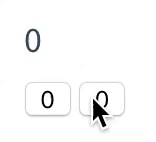

# 代码题

1. 请实现计数器：视图上有一个 `<div>` 和一个 `<button>`，如果点击 `<botton>` 则 `<div>` 中的数字加1

	[codeSandbox答案](https://codesandbox.io/s/rllvr5zrrn "codeSandbox答案")

	```javascript
	class App extends Component {
		constructor(props){
			super(props)
			this.state = {num: 0}
		}

		accum = (e)=> {
			this.setState((prev, props) => ({num: prev.num+1}) )
			// this.setState(function(prev, props){
			//   return {num: prev.num+1};
			// })
		}

		render() {
			return (
				<div className="name">
					<div>{this.state.num}</div>
					<button onClick={this.accum}>+1</button>
				</div>
			);
		}
	}
	```

2. 请使用属性动态绑定实现一个 `` 的 `src` 属性每隔 1s 自动变换，以实现图片自动切换。

	[codeSandbox地址](https://codesandbox.io/s/qxovjq0l76 "codeSandbox地址")

	```javascript
	import React from "react";
	import ReactDOM from "react-dom";

	class App extends React.Component {
		state = {
			index: 0,
			imgs: ["http://img0.imgtn.bdimg.com/it/u=998629003,2684711033&fm=27&gp=0.jpg",
			"http://img3.imgtn.bdimg.com/it/u=3717416115,3757797118&fm=27&gp=0.jpg",
			"http://img0.imgtn.bdimg.com/it/u=137928376,642249332&fm=27&gp=0.jpg"]
		};

		componentDidMount(){
			this.pic = setInterval(this.changeImg, 1000);
		}
		
		componentWillUnmount(){
			clearInterval(this.pic);
		}

		changeImg = () => {
			this.setState((pre, props) => ({
				index: (pre.index + 1) % pre.imgs.length
				})
			);
		};

		render() {
			return (
				<div className="App">
					
				</div>
			);
		}
	}

	const rootElement = document.getElementById("root");
	ReactDOM.render(<App />, rootElement);
	```
	

3. 请实现如下效果，注意第一行的计数器在父组件中，两个`Button`为两个 Component. 

	[codeSandbox地址](https://codesandbox.io/s/xl3qqx1pyp "codeSandbox地址")

	```javascript
	import React from "react";
	import ReactDOM from "react-dom";

	class Sum extends React.Component {
		state = {
			left: 0,
			right: 0
		}

		handleLeft = (e)=>{
			this.setState((pre, props)=>({ left: pre.left+1}))
		}

		handleRight= (e) => {
			this.setState((pre, props) => ({ right: pre.right + 1 }))
		}

		render() {
			return (
				<div>
					<div>{this.state.left+ this.state.right}</div>
					<button onClick={this.handleLeft}>{this.state.left}</button>
					<button onClick={this.handleRight}>{this.state.right}</button>
				</div>
			);
		}
	}

	const rootElement = document.getElementById("root");
	ReactDOM.render(<Sum />, rootElement);
	```
