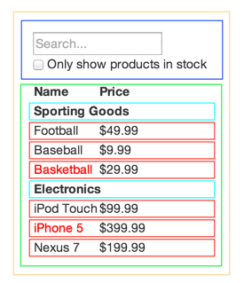

## 代码题

1. 请将上课实操[代码](https://codesandbox.io/s/387mr0rxvq)的按照如图所示的 Component 结构重构。要求：

    * 除了根组件，其他组件都是 Function Component
    * 图中相同颜色的框代表是相同的 Component
    

    [codeSandbox作业地址](https://codesandbox.io/s/m5wl6mr0my)

2. 请实现 [TodoList](https://fiddle.jshell.net/yyx990803/4dr2fLb7/show/light/) 所有功能，样式可自定义或使用官方的[CSS](https://github.com/tastejs/todomvc-app-css)。要求：

    * 除了根组件，其他组件都是 Function Component
    * 自行划分组件粒度，实现最大化复用
    * 每个 Todo 都是可以**双击编辑**的
    
    我的程序地址：  
      
    + [codeSandbox地址](https://codesandbox.io/s/l7v27j74z9)
    + [github地址](./second)

    目前主要实现的有：
    
    1. 没有TODO时， `#main` 和`#footer`隐藏
    2. New TODO， 进入页面，输入框自动获得焦点；输入后的结果需要自动去除前后的空白字符，使用`trim()`。
    3. 标记全部完成：全部完成按钮，点上后自动全部完成/自动全部没完成
    4. 每个todo item：
        1. 点击复选框，更新item的完成状态（`complieted`的值），通知更新父组件`li`的`completed`状态
        2. 双击item（`label`标签），进入item的编辑模式
        3. 鼠标放在item上面显示删除按钮。
    5. 编辑：
        1. 进入编辑会隐藏item的其他控制按钮，并且展示一个编辑框，并自动获取焦点，并展示之前的tiem标题。
        2. 失去焦点或者使用enter键，自动保存
        3. 使用`trime`去掉多余的空格，如果是空的item，直接删除
        4. 编辑过程中，使用了escape键，直接退出，不改变内容
    6. 计数：
        1. 单复数：当只有1个未完成时，使用`item`，其余的使用items。
    7. 清理完成的todo 项：自动删除所有完成了的todo项，没有任何todo的时候自动隐藏列表。

    目前待完善的点：
    
    1. 持久化：
        1. 使用`id`， `title`， `completed`表示一个item；
        2. 在edit mode时不进行存储
    2. 路由：
        1. 使用`#/`表示默认的所有
        2. `#/active`表示激活的todo item
        3. 使用`#/completed`表示完成的todo item项
    
    > 问题和不足：自己实现的版本中使用的是todomvc-app-css 2.0.0版本，主要是因为使用高版本中`toggle-all`一致显示不出来。比较主要的差别：2.0.0版本，是直接在`.toggle-all`上添加的`before`css属性，而最新版本是在`.toggle-all+label`上添加的`before`css属性。需要弄清楚官方例子中，`.toggle-all`与`label`并不是直接同一个父标签，怎么设置的css？ css中`+`选择器的意思？
    >`+`：兄弟选择器：例如` A + B`，选择**紧接**在A后的B元素，而且二者有**相同的父元素**，可以使用相邻兄弟选择器。 
    
    > 主要可参考：[github todo-mvc-react 实现](https://github.com/tastejs/todomvc/tree/gh-pages/examples/react)

