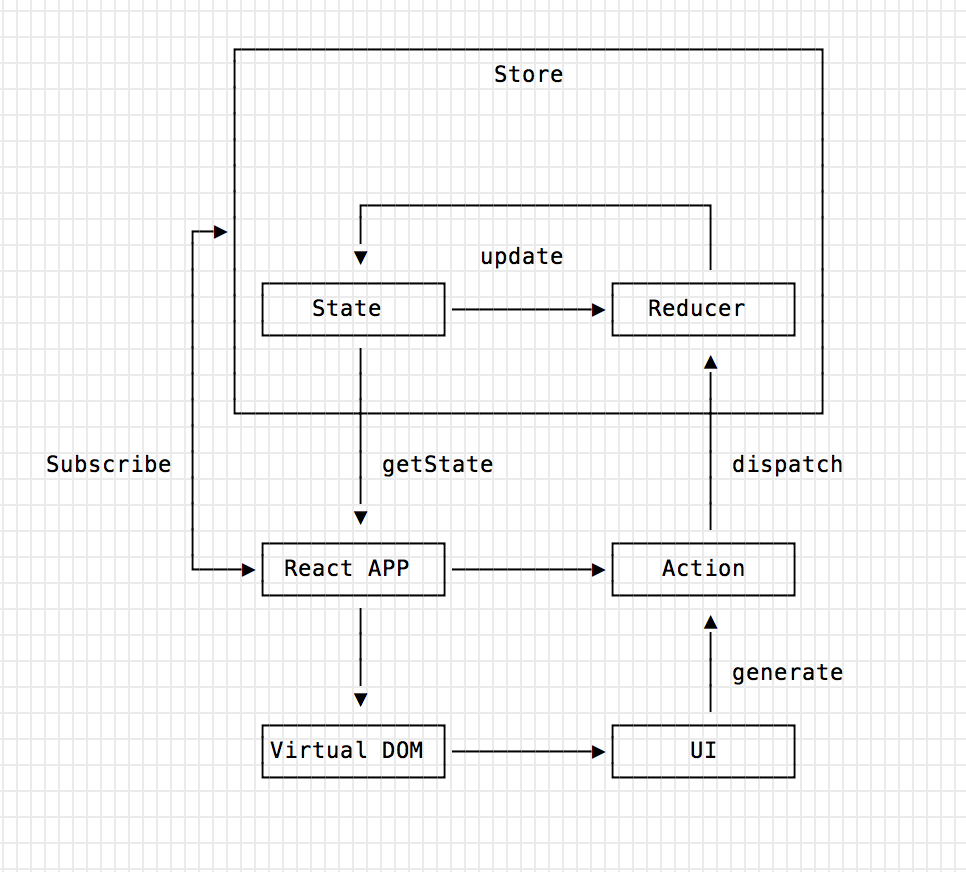

## 问答题

1. 实践中父子组件嵌套会很深，逐级传递麻烦而且易出错，怎么办？

	使用 react context api 或者redux框架解决该问题。
	
2. React 16.3 引入的 Context API 应该如何使用？请给出Demo

	1. 从`react`中解构获取`createContext`方法，创建context对象；
	2. 通过`context.Provider`的`value`属性向context中提供待共享的数据；
	3. 通过`context.Consumer`消费共享的数据。

	demo 如下：
	
	```javascript
	import React, { Component, createContext } from 'react';
	import './App.css';

	const Context = createContext()
	let data = { str: "hello world" }

	function SomeChildComponent() {
		return (
			<Context.Consumer>{
				data => (<div>  {data.str} </div>)
			}</Context.Consumer>
		)
	}
    
	class ContextTest extends React.Component {

		render() {
			return (
				<Context.Provider value={data} >
					<div>
						<SomeChildComponent />
					</div>
				</Context.Provider>
			)
		}
	}

	export default ContextTest;
	```

3. 同一个 React APP 中允许出现多个 Context 吗？如果允许，Provider 和 Consumer 是如何配对使用的
   
   允许，可以出现多个Context，每个Context独立管理各自的数据，例如Context A和B，向A中共享数据只能通过A的Provider提供，消费也只能通过A的Consumer消费。
   例如：
   
   ```javascript
   import React, { Component, createContext } from 'react';
   import './App.css';

	const A = createContext()
	const B = createContext()
	let dataA = { str: "this is A" }
	let dataB = { str: "this is B" }

	function AComponent() {
		return (
			<A.Consumer>{
				data => (<div>  {data.str} </div>)
			}</A.Consumer>
		)
	}

	function BComponent() {
		return (
			<B.Consumer>{
				data => (<div>  {data.str} </div>)
			}</B.Consumer>
		)
	}

	class ContextTest extends React.Component {

		render() {
			return (
				<div>
					<A.Provider value={dataA} >
						<div>A:
							<AComponent />
						</div>
					</A.Provider>
					<B.Provider value={dataB} >
						<div>B: 
							<BComponent />
						</div>
					</B.Provider>
				</div>
			)
		}
	}

	export default ContextTest;
   ```

4. 如果一个组件是 Function Component，如何快速改造使其可以通过 Consumer 获取数据？

	通过将Function Component的的事件响应放在context中，并且在父组件中使用`Context.Provider`的`value`属性提供相关的属性值和事件响应；
	在Function Component中使用`Context.Consumer`，获取context中提供的数据和操作方法。然后绑定到component上面。
	
	codesandbox地址如下：[codeSandbox](https://codesandbox.io/s/484mkz9490 "codeSandbox")
	
	例如，源function component如下：
	
	```javascript
	import React from  "react"

	function Button(props){
		return(
			<div>
				<button onClick={props.handleClick}>{props.value}</button>
			</div>
		)
	}

	export default class Test extends React.Component{
		state={
			val:0
		}

		handleClick = e =>{
			this.setState(prev=>{return {val: prev.val+1}})
		}
		render(){
			return(
			<div>
				<Button handleClick={this.handleClick} value={this.state.val}/>
			</div>
			)
		}
	}
	```
	
	改造成Context API如下：
	
	```javascript
	import React, { createContext } from "react"

	const Context = createContext();
	function Button(props) {
		return (
			<Context.Consumer>{
				data => {
				return <button onClick={data.click}>{data.val}</button>
				}
			}
			</Context.Consumer>)
		}

	export default class Test extends React.Component {
	  state = {
		val: 0,
		click: e => {
			this.setState(prev => { return { val: prev.val + 1 } })
			}
		}
		render() {
			return (
				<Context.Provider value={this.state}>
					<div>
						<Button handleClick={this.handleClick} value={this.state.val} />
					</div>
				</Context.Provider>
			)
		}
	}
	```

5. 什么情况下 **不需要** 使用 Redux？什么时候 **需要** 使用？

	以下情况不需要使用 redux ：
	
	- 用户的使用方式非常简单
	- 用户之间没有协作
	- 不需要与服务器大量交互，也没有使用 WebSocket
	- 视图层（View）只从单一来源获取数据
	
	以下情况可能需要使用redux：
	
	- 用户的使用方式复杂
	- 不同身份的用户有不同的使用方式（比如普通用户和管理员）
	- 多个用户之间可以协作
	- 与服务器大量交互，或者使用了WebSocket
	- View要从多个来源获取数据
	
6. Redux 的设计思想是什么？

	redux的设计思想：
	
	1. **Web 应用是一个状态机，视图与状态是一一对应的**。
	2. **所有的状态，保存在一个对象里面**。

7. 如何新建一个 `store` 实例？`store` 实例上有哪些方法可以调用，各是干什么的？

	通过`redux.createStore`创建实例，该方法接受一个函数作为参数。
	`store` 实例上可以调用的方法有：
	
	1. `store.getState()`: 获取store当前的数据集合；
	2. `store.dispatch()`: viwe向store发出Action；
	3. `store.subscribe()`: 设置state监听函数，一旦state变化，自动触发函数并执行

8. 请说明 Redux 是如何更新 State，最好能画出更新的流程图

	redux更新状态的流程如下图所示：
	
	
	1. 初始化是store中保存着初始状态和reducer（action的处理逻辑）；
	2. react app初始化，展示UI；react app 监听state的状态变化
	3. 通过UI产生Action，并通过dispatch，reducer基于当前的状态和Action产生新的state
	4. react app监听到state变化，操作虚拟DOM，更新UI。

9. Action 一般至少包含哪个字段？Action Creator 和 Action 的关系如何？

	一般Action至少包含type字段，表示Action的类型；ActionCreator是生成Action的函数。

10. Reducer 是什么？为什么它的名字和 `Array.prototype.reduce` 如此相关？他们之间有什么关系？

	Reducer是Store中State的计算逻辑，它将数据从一个状态变为一个新的状态。
	它们都是纯函数，接受一个函数和一个初始状态，然后产生一个结果，并且相同的输入由相同的输出（幂等性）。

11. 什么是纯函数？Redux 要求 Reducer 必须是纯函数吗？

	纯函数：一个函数的返回结果只依赖于它的参数，并且在执行过程里面没有副作用。
	Reducer必须是纯函数，因为这样，相同的State和Action会产生唯一的State，这样State状态能保持唯一性。

12. 什么是UI 组件和容器组件，它们各有什么特点？

	UI组件，只负责UI展示，没有内部状态。有以下几个特点：
	
	1. 只负责 UI 的呈现，不带有任何业务逻辑
	2. 没有状态（即不使用this.state这个变量）
	3. 所有数据都由参数（this.props）提供
	4. 不使用任何 Redux 的 API
	
	容器组件，负责业务逻辑处理，有内部状态，它有以下几个特点：
	
	1. 负责管理数据和业务逻辑，不负责 UI 的呈现
	2. 带有内部状态
	3. 使用 Redux 的 API

13. `connect` 接受的两个参数 `mapStateToProps` 和 `mapDispatchToProps` 各是什么含义？我们需要传入什么？请给出demo

	 `mapStateToProps`是一个函数，建立一个从state对象到props对象的映射关系；会自动订阅store，当state更新时，会自动执行并更新UI组件；第一个参数是state对象，第二个参数代表容器的props对象。
	 `mapDispatchToProps`用来建立UI组件到`store.dispatch`方法的映射，定义了用户操作的Action，它可以是一个函数，也可以是一个对象。如果是一个函数，那么函数的参数是`dispatch`和UI组件的props；如果是一个对象，对象的中key对应的value是一个Action Creator函数。
	 
	 demo如下，完整的demo地址：[demo](https://codesandbox.io/s/r0jxr275no "demo")
	 
	 ```javascript
	 const mapStateToProps = (state) => {
		return {
			value: state.cnt
		}
	}
	const mapDispatchToProps = (dispatch) => {
		return {
			reduceHandler: () => {
				dispatch({ type: 'REDUCE' });
			},
			addHandler: () => {
				dispatch({ type: 'ADD' });
			}
		}
	}
	 ```

14. React-Redux 中使用的 Provider 和 connect 与 React 的 Context API 功能上很类似，他们的实现上有什么关系？（本题请自行查阅资料或查看源码完成）

	它们都是将数据提交到数据中心，统一管理。一个是将数据提交到redux的store中，一个是提交到react的context中保存。都是基于单一数据源原则，实现将数据存放到数据源中。
